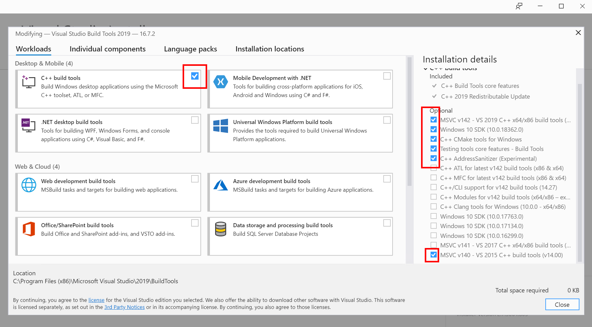

# THIS REPO AND README IS STILL UNDER HEAVY DEVELOPMENT!

# About this repo

All data required for this GitHub project can be downloaded by using the provided DaterLoader script.  
Simply calling:  
```
DataLoader().download_datasets(root_dir)
DataLoader().download_trained_models(root_dir)
DataLoader().generateAllJsonDataAnnotations(root_dir)
``` 
Will download the datasets from the OMR-Datasets repository,  
download all the trained models as specified in the overview and  
generate the json annotations for the datasets.

## Faster R-CNN and ResNet-50 backbone
|   Model Name        |   Iterations  |    mAP   |    AP75  |    AP50  |
|:-------------------:|:-------------:|:--------:|:--------:|:--------:|
|   System measures   |     5700      |  95.578  |  98.952  |  98.970  |
|   Stave measures    |     9000      |  87.510  |  96.744  |  98.020  |
|      Staves         |     5700      |  93.173  |  100.00  |  100.00  |
|      Combined       |     TODO      |  TODO  |  TODO  |  TODO  |

## scores for the combined dataset per category
| Category        | mAP    | Category       | mAP    | Category   | mAP    |
|:---------------:|:------:|:--------------:|:------:|:----------:|:------:|
| system_measures | TODO | stave_measures | TODO | staves     | TODO |

## Faster R-CNN and ResNet-101 backbone
|   Model Name        |   Iterations  |    mAP   |    AP75  |    AP50  |
|:-------------------:|:-------------:|:--------:|:--------:|:--------:|
|   System measures   |     8700      |  96.401  |  98.864  |  98.909  |
|   Stave measures    |     6300      |  87.476  |  96.823  |  98.020  |
|      Staves         |     15600     |  94.293  |  100.00  |  100.00  |
|      Combined       |     TODO      |  TODO  |  TODO  |  TODO  |

## scores for the combined dataset per category
| Category        | mAP    | Category       | mAP    | Category   | mAP    |
|:---------------:|:------:|:--------------:|:------:|:----------:|:------:|
| system_measures | TODO | stave_measures | TODO | staves     | TODO |

# Installation Setup

Requirements before starting:  
Python >= 3.6  
to run training and testing you need a CUDA capable device and the CUDA Toolkit 10.1  
you can run the streamlit app which does inference without CUDA

## For Linux:

Step 1:  
You will require some build / development tools, install them by running:  
```
sudo yum groupinstall "Development Tools"
or
sudo apt install build-essential
```

Step 2:  
Install python development version.  
```
sudo yum install python36-devel
or
sudo apt-get install python-dev
```

Step 3:
Install cython manually before running the requirements install:
```pip3 install cython```
It is needed for pycocotools because pip will build all packages first, before attempting to install them. ((ﾉ☉ヮ⚆)ﾉ ┻━┻)

Step 3:  
install all the required python libraries from this repository:  
```pip3 install -r Python/linux_requirements.txt```

## For Windows:

Requirements:  
Windows SDK  
C++14.0 build tools  
Microsoft Visual C++ Redistributable  
can all be installed with the Visual Studio installer.  
https://visualstudio.microsoft.com/thank-you-downloading-visual-studio/?sku=BuildTools&rel=16  


Step 1:  
install all the required python libraries from the OMR-MeasureRecognition repo.  
```pip install -r Python/windows_requirements.txt```

Step 2:  
manually install detectron2 because there is no windows support, we need to pull and install from source  
```
git clone https://github.com/facebookresearch/detectron2.git
cd detectron2
git reset --hard be792b959bca9af0aacfa04799537856c7a92802 # to pull detectron version 0.2.1
```

Step 3:  
change the following line in detectron2\detectron2\layers\csrc\cocoeval\cocoeval.cpp(483):  
localtime_r(&rawtime, &local_time) to localtime_s(&local_time, &rawtime);  
solution from : https://github.com/conansherry/detectron2/issues/2  

Step 4:  
now you can install detectron2 with:  
```python setup.py install```
Requires admin privileges, so run cmd as admin!

## Hack to accept multiple files with streamlit API:

if you want to be able to use inference on multiple files you will have to modify the streamlit code.  
First find where your python side-packages are located by running:
```pip show streamlit```  
From here navigate to elements\file_uploader.py  
Open and change the line accept_multiple_files = False to accept_multiple_files = True  
This might change in future versions of streamlit to be enabled by default, but the current version I am using (0.66.0) needs this fix.  
I will remove this fix if any future versions of streamlit update this.